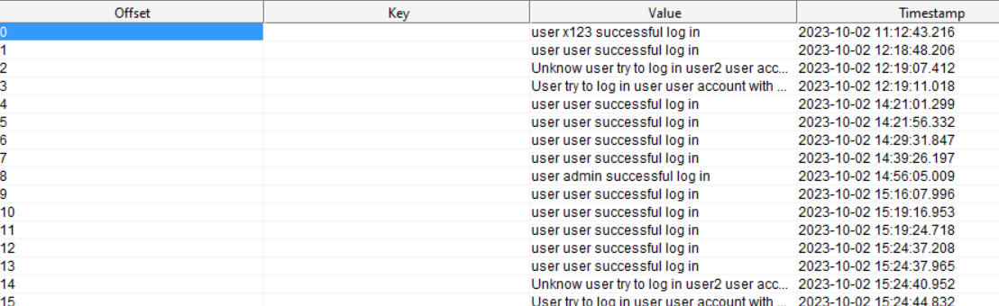

<H3>NoSQL, домашнее задание</H3>
В получившемся Reactive приложении, заменить хранилище паролей с реляционной БД на NoSQL. 
Реализовать возможность получения Auth-event'ов от приложения через топик auth-events в Kafka. 
В топик отправлять аудит-события вида  
"user x123 successful log in", "Unknow user try to log in x123 user account",
"user x123 change password"

По полученному топику складывать метрики и отображать в Grafana в виде "Un/Successful log in" 

`docker run -d -p 9090:9090 --name prometheus -v <path>prometheus.yml:/etc/prometheus/prometheus.yml prom/prometheus`  
`docker run -d -p 3000:3000 grafana/grafana`   
`config/prometheus.yml`   
дашборд для графана: 
`config/dashboard/login.json`   

